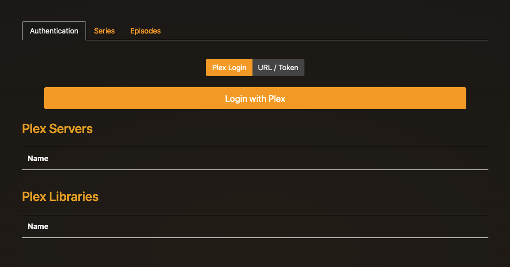
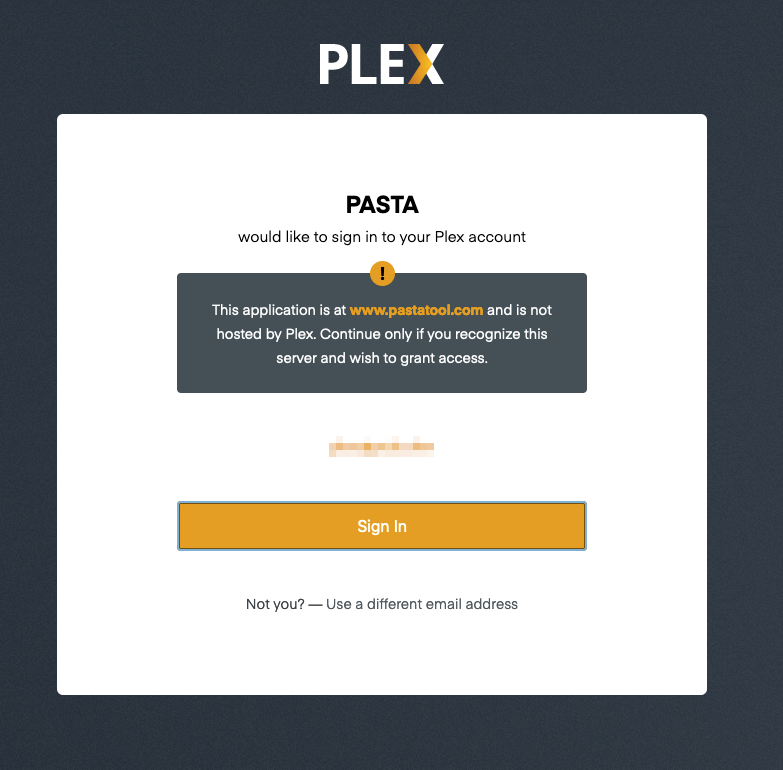
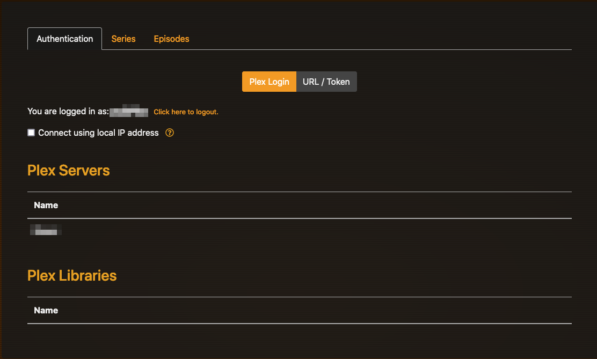
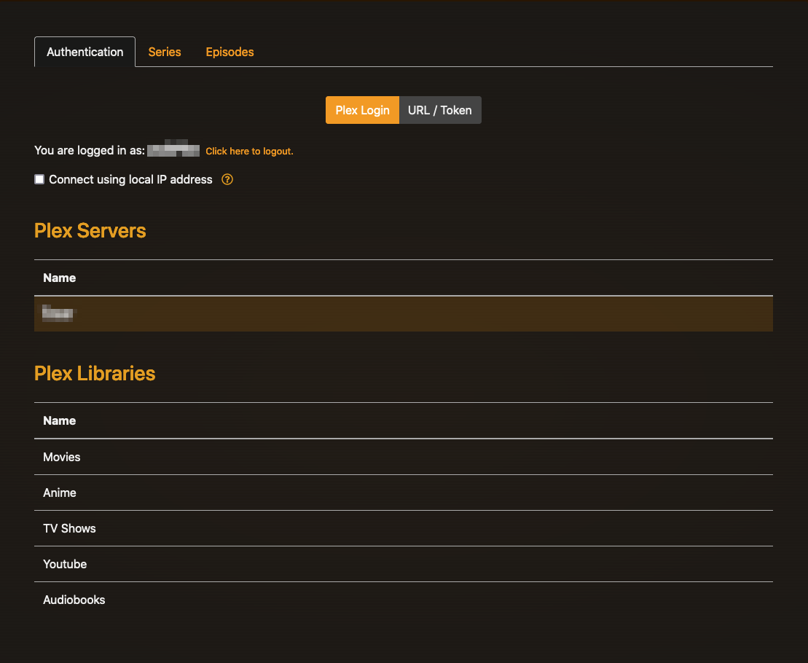
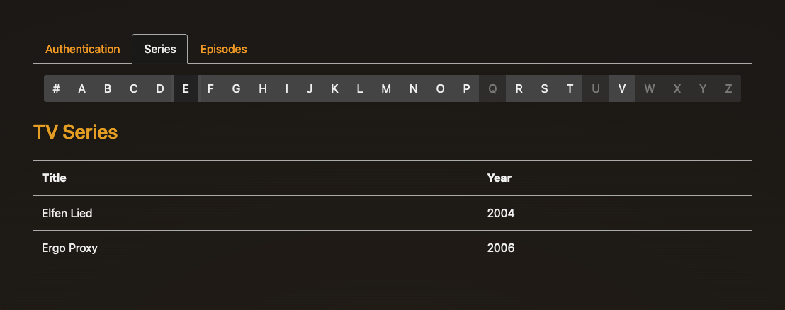
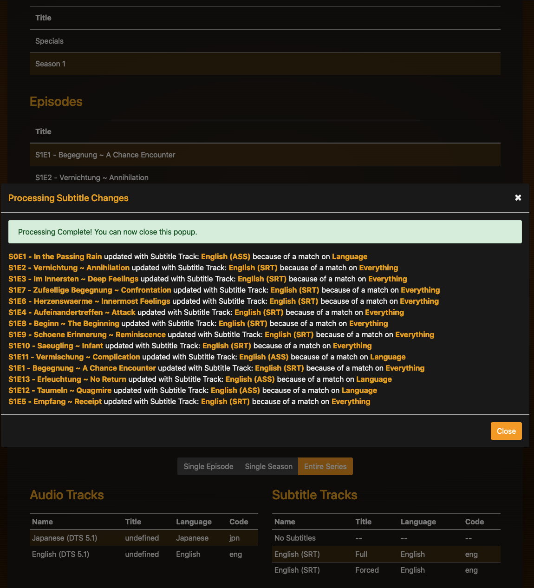

# Pasta Tool Walkthrough

Begin by logging into plex. You may have to allow popups.

After a successful authentication, you will be shown a list of servers. Select your server then select the library that has the show which requires a language/subtitle change.

Navigate by letter the show/series and select the appropriate one.

Once you are at the show, select **Entire Series**

Then select a single episode -- it usually doesnt matter which one. You will get language and subtitle options. Select the appropriate *audio track* or *subtitle track*. It should automatically change the subtitles and show you which episode's tracks were changed. 

⚠️ 

In this example, the episode selected had the "correct" audio track already selected. In some cases, the default audio track may not be the one you want. To ensure consistency, you should reselect the language track you want to make sure the entire series uses the same track. 

All done!
